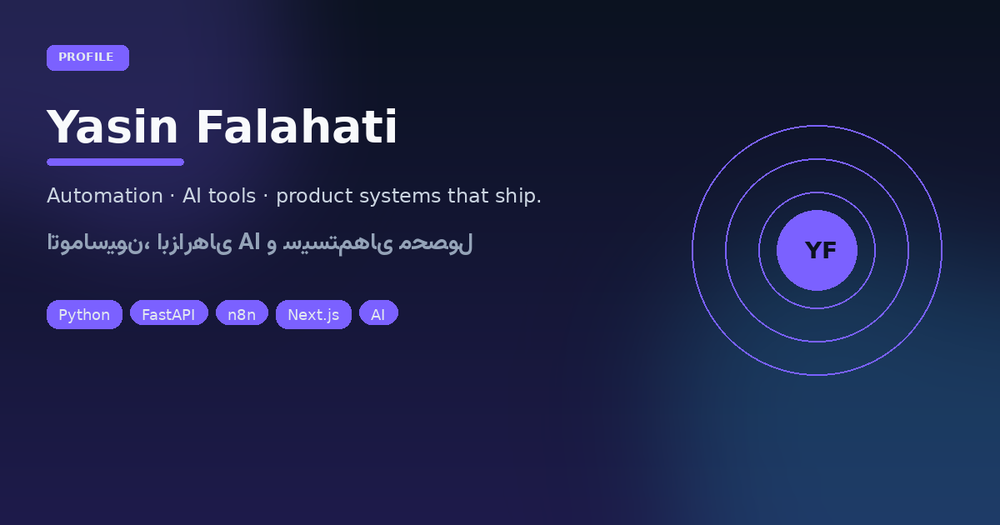

 

> **Builder from Iran.** I ship automation pipelines, local-first AI desks, and bilingual product systems — for newsrooms, repair shops, gyms, and health workflows — not disposable demos.

<strong>🇬🇧 English — who I am</strong>

 

I work end-to-end: Python backends & bots, n8n workflows, Next.js/TypeScript UIs, OpenCV/Whisper/Ollama on the metal, and static news machines that publish themselves at midnight Tehran time.

### Selected ships

| | Project | One-liner |
|---:|---|---|
| 📰 | [Nabz-e Farda](https://nabz-farda.vercel.app) | Nightly Persian AI/tech/gaming news — static + Telegram/Instagram |
| 🧠 | [NORA](https://github.com/yasinfallahati/NORA) | Private LAN chat & image studio (Ollama / ComfyUI) |
| 🎤 | [Voice Desk](https://github.com/yasinfallahati/voice-desk) | Telegram → Linux with local Whisper + Ollama |
| 📱 | [Fixo](https://github.com/yasinfallahati/fixo) | ADB AI desk for Android repair counters |
| 👁️ | [Attendance](https://github.com/yasinfallahati/Attendance-system) | Face-recognition clock-in + Excel |
| 🏋️ | [Gymzo](https://github.com/yasinfallahati/gymzo_yasin) | Club / coach / athlete ops (Next.js + Prisma) |
| 💬 | [Vexo](https://github.com/yasinfallahati/vexoo) | Self-hosted realtime messenger |
| 🩺 | [Vibero](https://github.com/yasinfallahati/vibero) | Patient · family · doctor digital health |

**Contact:** [fallahatiyasin829@gmail.com](mailto:fallahatiyasin829@gmail.com) · [portfolio](https://profileyasin.vercel.app/)

---

<strong>🇮🇷 فارسی — من کیستم؟</strong>

 

من **یاسین فلاحتی** هستم؛ روی **اتوماسیون**، **ابزارهای AI محلی** و **سیستم‌های محصول دوزبانه** کار می‌کنم — برای تحریریه، تعمیرگاه، باشگاه و سلامت دیجیتال؛ نه دموهایی که در پوشه می‌میرند.

### مسیر کار

| حوزه | نمونه واقعی |
|------|-------------|
| خبر و انتشار | نبض فردا — RSS شبانه → سایت استاتیک → تلگرام/اینستا |
| AI خصوصی | نورا، ویس‌دسک، فیکسو |
| محصول وب | جیمزو، وکسو، ویبرو |
| دسکتاپ | حضور و غیاب چهره، نوبت‌دهی، بازی‌ها و ماشین‌حساب‌ها |

### پروژه‌های منتخب (فارسی)

- **نبض فردا** — خبر فارسی AI/تک/گیم هر شب بدون سرور اپلیکیشن  
- **NORA** — چت و تصویر روی LAN خودتان  
- **Voice Desk** — فرمان دسکتاپ لینوکس از تلگرام با Whisper محلی  
- **Fixo** — میزکار تعمیر اندروید با ADB  
- **Gymzo / Vexo / Vibero** — باشگاه، پیام‌رسان، سلامت دیجیتال  

**ارتباط:** [ایمیل](mailto:fallahatiyasin829@gmail.com) · [پورتفolio](https://profileyasin.vercel.app/)

 

`automation` · `local-ai` · `fastapi` · `nextjs` · `persian` · `telegram` · `opencv` · `self-hosted`

