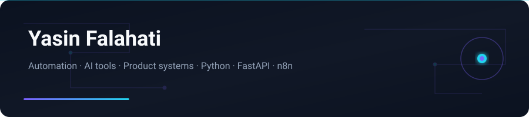

 

## English

### Intro

I'm **Yasin Falahati** — a builder from Iran focused on **automation**, **AI tooling**, and **product systems** that ship.

I work across Python backends, workflow automation (n8n), Telegram bots, and modern web UIs (Next.js / TypeScript). Most of what I build is bilingual (**Persian ↔ English**) and designed for real operators: repair shops, newsrooms, gyms, health workflows — not demos that die in a folder.

### What I build

| Area | Focus |
|------|--------|
| **Automation** | Nightly pipelines, RSS → content, Telegram/Instagram publishing |
| **AI tools** | Local-first assistants (Ollama), OpenAI-compatible UIs, voice/STT desks |
| **Product systems** | Gym ops, messaging, digital health, shop bots |
| **Desktop / local** | ADB repair desks, attendance (face recognition), Linux control bots |

### Featured projects

| Project | What it is | Links |
|---------|------------|-------|
| **Nabz-e Farda** | Nightly Persian AI/tech/gaming news — static site + social publishing | [Live](https://nabz-farda.vercel.app) |
| **NORA** | Private local AI chat & image studio (Ollama / ComfyUI / OpenAI-compatible) | [Repo](https://github.com/yasinfallahati/NORA) |
| **Voice Desk** | Telegram → Linux desktop control with local Whisper + Ollama | [Repo](https://github.com/yasinfallahati/voice-desk) |
| **Attendance System** | Face-recognition attendance with Excel export (OpenCV) | [Repo](https://github.com/yasinfallahati/Attendance-system) |
| **Fixo** | Local AI desk for Android phone repair shops (ADB) | [Repo](https://github.com/yasinfallahati/fixo) |
| **ClickHunt** | Two-player fullscreen cursor-hunt game (Tkinter) | [Repo](https://github.com/yasinfallahati/ClickHunt) |
| **Todo Dashboard** | Goals, daily tasks, meetings — HTML/Tailwind/Chart.js | [Repo](https://github.com/yasinfallahati/todo) |
| **Chat Bot** | Single-page OpenAI chat + image gen (browser-only) | [Repo](https://github.com/yasinfallahati/chat-bot) |
| **Quiz Game** | Persian Quiz-of-Kings style simulator | [Repo](https://github.com/yasinfallahati/Quiz_game) |
| **Queuing System** | Beauty salon appointment GUI | [Repo](https://github.com/yasinfallahati/Queuing-system) |

### Tech stack

  

**Backend / automation:** Python · FastAPI · Flask · n8n · Telegram Bot API  
**AI / data:** Ollama · OpenAI-compatible APIs · Whisper · OpenCV · NumPy  
**Frontend:** Next.js · TypeScript · React · Tailwind · HTML/CSS/JS  
**Ops:** Linux · Vercel · GitHub Actions · local-first / self-host patterns  

### Contact

- **Email:** [fallahatiyasin829@gmail.com](mailto:fallahatiyasin829@gmail.com)
- **Portfolio:** [profileyasin.vercel.app](https://profileyasin.vercel.app/)
- **GitHub:** [github.com/yasinfallahati](https://github.com/yasinfallahati)

---

## فارسی

### معرفی

من **یاسین فلاحتی** هستم — از ایران، متمرکز روی **اتوماسیون**، **ابزارهای هوش مصنوعی** و **سیستم‌های محصول** که واقعاً به تولید می‌رسند.

با بک‌اند پایتون، اتوماسیون گردش‌کار (n8n)، ربات‌های تلگرام و رابط‌های وب مدرن (Next.js / TypeScript) کار می‌کنم. بیشتر پروژه‌هایم **دوزبانه (فارسی ↔ انگلیسی)** هستند و برای کاربر واقعی طراحی شده‌اند: تعمیرگاه، تحریریه خبر، باشگاه، سلامت دیجیتال — نه فقط دمو.

### چه می‌سازم؟

| حوزه | تمرکز |
|------|--------|
| **اتوماسیون** | پایپ‌لاین شبانه، RSS → محتوا، انتشار تلگرام/اینستاگرام |
| **ابزارهای AI** | دستیارهای محلی (Ollama)، رابط‌های سازگار با OpenAI، میزهای صوتی/STT |
| **سیستم محصول** | عملیات باشگاه، پیام‌رسان، سلامت دیجیتال، ربات فروش |
| **دسکتاپ / محلی** | میزکار تعمیر اندروید (ADB)، حضور و غیاب چهره، کنترل لینوکس |

### پروژه‌های منتخب

| پروژه | توضیح کوتاه | لینک |
|-------|-------------|------|
| **نبض فردا** | خبر شبانه فارسی AI/تک/گیم — سایت استاتیک + انتشار اجتماعی | [لایو](https://nabz-farda.vercel.app) |
| **NORA** | استودیوی چت و تصویر AI محلی و خصوصی | [ریپو](https://github.com/yasinfallahati/NORA) |
| **Voice Desk** | کنترل دسکتاپ لینوکس از تلگرام با Whisper و Ollama محلی | [ریپو](https://github.com/yasinfallahati/voice-desk) |
| **سیستم حضور و غیاب** | تشخیص چهره + خروجی اکسل | [ریپو](https://github.com/yasinfallahati/Attendance-system) |
| **Fixo** | میزکار AI برای تعمیرگاه موبایل اندروید | [ریپو](https://github.com/yasinfallahati/fixo) |
| **ClickHunt** | بازی دونفره شکار نشانگر ماوس | [ریپو](https://github.com/yasinfallahati/ClickHunt) |
| **Todo** | داشبورد اهداف و کارهای روزانه | [ریپو](https://github.com/yasinfallahati/todo) |
| **Chat Bot** | چت و تولید تصویر OpenAI در مرورگر | [ریپو](https://github.com/yasinfallahati/chat-bot) |
| **Quiz Game** | شبیه‌ساز سبک کوییز آو کینگز | [ریپو](https://github.com/yasinfallahati/Quiz_game) |
| **سیستم نوبت‌دهی** | نوبت‌دهی آرایشگاه با Tkinter | [ریپو](https://github.com/yasinfallahati/Queuing-system) |

### ارتباط

- **ایمیل:** [fallahatiyasin829@gmail.com](mailto:fallahatiyasin829@gmail.com)
- **پورتفolio:** [profileyasin.vercel.app](https://profileyasin.vercel.app/)

---

`#Python` `#FastAPI` `#AI` `#Automation` `#n8n` `#TelegramBot` `#NextJS` `#TypeScript` `#OpenCV` `#Ollama` `#Persian` `#Iran`

