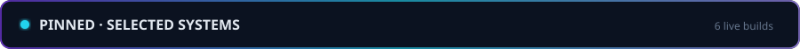
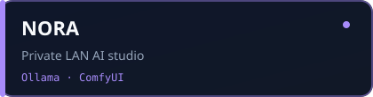
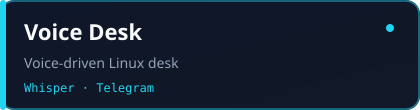
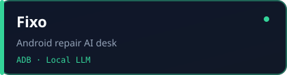
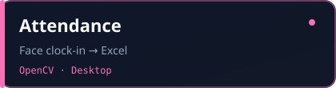
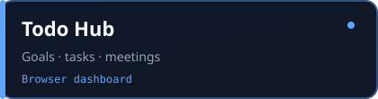
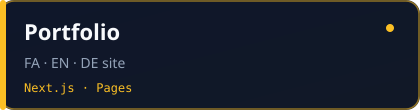

Designing and shipping production-minded systems end to end: backends, pipelines, interfaces, and the infrastructure that keeps them running.

[Portfolio](https://profileyasin.vercel.app/) · [Email](mailto:fallahatiyasin829@gmail.com) · [GitHub](https://github.com/yasinfallahati)

## Focus

- **Automation & data pipelines** — scheduled, self-publishing systems with no manual steps (RSS → processing → static site → Telegram / Instagram).
- **Local-first AI** — private LLM, speech, and vision workloads running on your own hardware (Ollama, Whisper, ComfyUI, OpenCV), with no data leaving the machine.
- **Product engineering** — multi-role web platforms (admin / coach / athlete / patient / doctor) with clean data models and RTL-aware, bilingual UX.

## Engineering principles

- **Ship to production, not to a folder.** Every project here runs for a real user or workflow.
- **Own the whole stack.** API design, data modeling, UI, deployment, and observability.
- **Prefer simple, durable architecture.** Static output over servers when possible; self-hosted when privacy matters.
- **Localization is a feature.** Persian/English support is built into the data and UI layers, not patched on later.

## Pinned systems

  

> Six production-minded builds — private AI, automation, and product surfaces. Not demos.

<table>
<tr>
<td width="50%" valign="top">

**[NORA](https://github.com/yasinfallahati/NORA)** — air-gapped AI chat + image studio on your LAN. Models stay home.

</td>
<td width="50%" valign="top">

**[Voice Desk](https://github.com/yasinfallahati/voice-desk)** — talk to your Linux machine over Telegram. Local Whisper + Ollama, zero cloud STT.

</td>
</tr>
<tr>
<td width="50%" valign="top">

**[Fixo](https://github.com/yasinfallahati/fixo)** — AI bench for Android repair shops. ADB diagnostics, Wi-Fi/VPN/backup workflows.

</td>
<td width="50%" valign="top">

**[Attendance](https://github.com/yasinfallahati/Attendance-system)** — face clock-in that ships Excel/CSV reports. Built for real desks, not slideware.

</td>
</tr>
<tr>
<td width="50%" valign="top">

**[Todo Hub](https://github.com/yasinfallahati/todo)** — goals, daily tasks, progress charts, meetings — one browser command center.

</td>
<td width="50%" valign="top">

**[Portfolio](https://github.com/yasinfallahati/Yasin_information)** — trilingual personal site (FA / EN / DE) on Next.js + GitHub Pages.

</td>
</tr>
</table>

### Also shipping

| | |
|---|---|
| [**Nabz-e Farda**](https://nabz-farda.vercel.app) | Nightly Persian AI/tech/gaming news — static site + Telegram + Instagram, fully automated |
| [**Gymzo**](https://github.com/yasinfallahati/gymzo_yasin) | Club · coach · athlete ops platform |
| [**Vexo**](https://github.com/yasinfallahati/vexoo) | Self-hosted realtime messenger |
| [**Vibero**](https://github.com/yasinfallahati/vibero) | Patient · family · doctor health platform |

## Technical stack

| Area | Tools |
|---|---|
| **Backend** | Python, FastAPI, REST APIs, Telegram Bot API |
| **Frontend** | Next.js, TypeScript, React, Tailwind CSS |
| **Data** | PostgreSQL, Prisma, SQLite |
| **AI / ML** | Ollama, Whisper, ComfyUI, OpenCV |
| **Automation** | n8n, cron-based pipelines, RSS ingestion |
| **Infra** | Docker, Linux, Vercel, self-hosting |

## Contact

Open to collaboration on automation, AI tooling, and product builds.

- Email: [fallahatiyasin829@gmail.com](mailto:fallahatiyasin829@gmail.com)
- Portfolio: [profileyasin.vercel.app](https://profileyasin.vercel.app/)

---

<strong>🇮🇷 فارسی</strong>

### یاسین فلاحتی

مهندس نرم‌افزار؛ تمرکز روی **اتوماسیون**، **هوش مصنوعی محلی** و **سیستم‌های محصول دوزبانه**. پروژه‌هایی که واقعاً اجرا می‌شوند و برای تحریریه، تعمیرگاه، باشگاه و سلامت دیجیتال کار می‌کنند.

**نمونه کارها**

- **نبض فردا** — خبر فارسی AI/تک/گیم هر شب، کاملاً خودکار و بدون سرور اپلیکیشن
- **NORA** — چت و تولید تصویر خصوصی روی شبکه محلی
- **Voice Desk** — کنترل دسکتاپ لینوکس از تلگرام با Whisper محلی
- **Fixo** — میزکار هوشمند تعمیر اندروید با ADB
- **Gymzo / Vexo / Vibero** — پلتفرم باشگاه، پیام‌رسان و سلامت دیجیتال

**ارتباط:** [ایمیل](mailto:fallahatiyasin829@gmail.com) · [پورتفولیو](https://profileyasin.vercel.app/)

